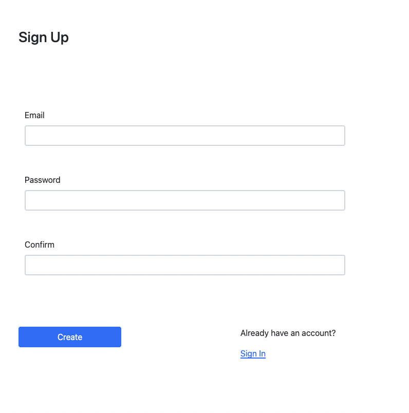
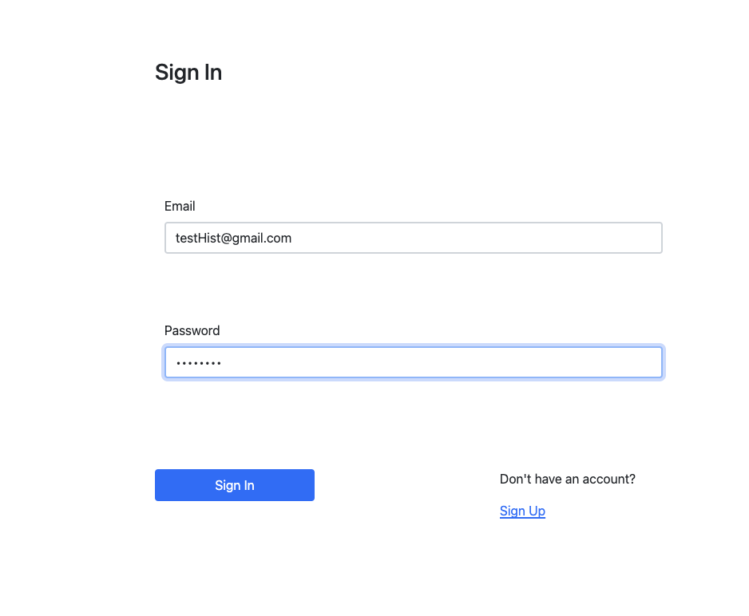
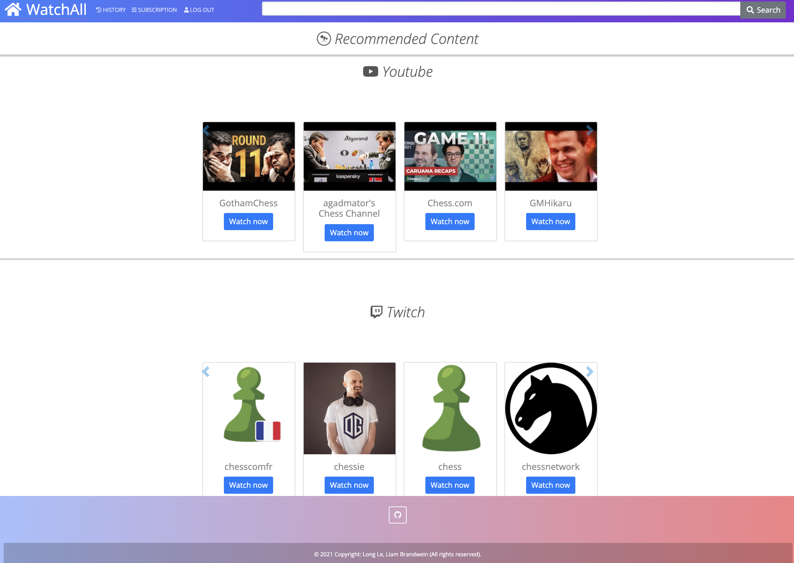
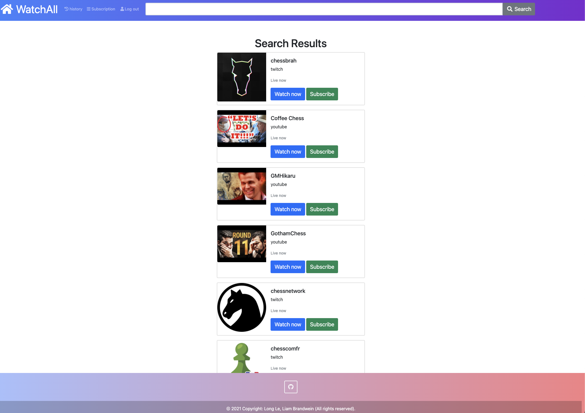
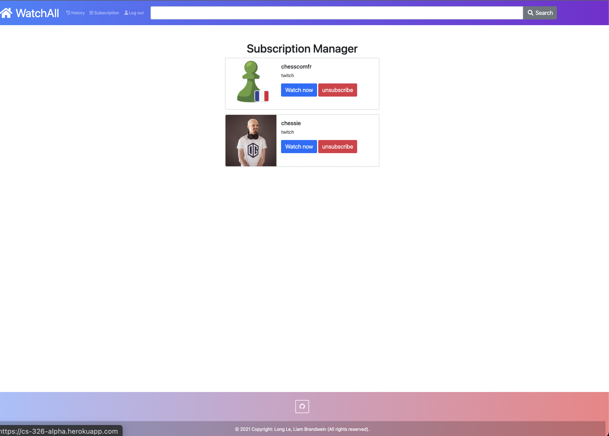
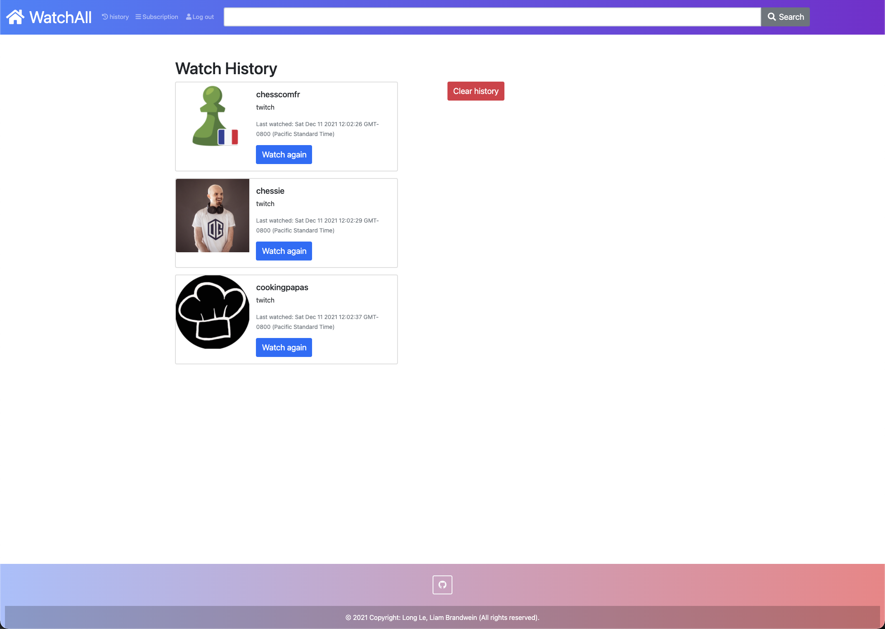

# Team Alpha
# WatchAll - Fall 2021
Link: https://cs-326-alpha.herokuapp.com
## Overview
WatchAll's purpose is to consolidate two of the biggest video and streaming content providers, YouTube and Twitch, in one place, allowing a user to keep track of their favorite content creators at once. WatchAll allows a user to create an account, search for content, subscribe to creators on Twitch and YouTube (through our site, e.g. the subscriptions are stored on our database), watch the creators, view their watch history, and get recommended new content on the home page.  
  
## Team Members
Liam Brandwein, GitHub: liambrandwein  
Long Le, GitHub: vlongle  
  
## User Interface

| UI view      						| Name		    |  Description|
| ----------- 						| ----------- | ----------- |
|  		| Sign-up        |  The user can sign up a new account.      |
|  		| Sign-in        |  The user can sign in.      |
|  			| Home        |  The user can get their recommended concent, including the content from their subscribed creators here.      |
|  		| Search Results        |  The user can search for content across platforms (Youtube and Twitch) through the search bar. The returned results will be displayed here.      |
|  		| Subscription Manager        |  The user can unsubscribe or watch their creators from here.      |
|  		| History        |  This page displays the user's watch history with timestamps. The user can also clear their history.      |

## APIs

## Database
The data is stored using MongoDB, specifically MongoDB Atlas. The Database is called "watchalldata". Within are 4 collections: userdata, usersubdata, userwatchhistdata, and creatordata. Userdata stores emails and passwords (salted + hashed). Usersubdata stores a list of creator names/IDs along with the corresponding users' ID's (emails). Userwatchhistdata is similar to usersubdata except it also stores timestamps for the watch history page. Creatordata is a collection of data for each content creator -- this is used by pages such as watch history and subscriptions to display data about content creators. Content creator lists are fetched from usersubdata and userwatchhistdata, and then the necessary data is fetched from creatordata.

## URL Routes/Mappings

## Authentication/Authorization
Nobody can view the site unless they have an account. Creating an account requires an unused email and a password of at least 8 characters. Once the account is created, the password is salted, hashed, and stored (along with the email) in 'userdata' as described above. Logging in creates a session that is stored in a cookie -- express-session is used for this. The session times out eventually, and revisting the site often requires a relogin by design. Only a logged-in user can access the API, and only through the site, and only for their data (watch history, subscriptions).

## Divison of Labor
The percentage of contribution for each team member is as follows:

| Parts | Long |  Liam |
| ----------- 						| ----------- | ----------- |
External API calls (to Twitch, Youtube)	| 80% | 20% |
HTML/CSS pages  | 70% | 30% |
Routing | 40% | 60% |
Mongodb databases | 30% | 70% |
Secure authentication and session | 20% | 80% |
Miscellaneous algorithms (e.g. for recommendation) | 60% | 40% |
Total | 50% | 50% |

## Conclusion

## Rubric

### General &emsp; &emsp; &emsp; &emsp; &emsp; ___ / 25 pts

- Secure authentication
  - Successfully create a user through sign up
  - Successfully login a user
  - Only able to view the details of the inner pages if you are a user.
    - We acknowledge that the page will start to load the html if you are not logged in; however, no details will be displayed.
  - API/Database only accesible through the site with a logged-in user  
- Database
  - Database is remotely hosted on MongdoDB.
  - Database is accessible through the API.
  - Database is accessible through the site.
- Routing
- Linting/ code style

### Subscription Page &emsp; &emsp; &emsp; &emsp; &emsp; ___ / 15 pts
- Successfully view creators
- Succesfully displays creator thumbnails
- Allows you to click on 'Watch now' to link to the creator's page
- Watching a creator adds that creator to watch history
- Can unsubsribe from a creator

### Watch History Page &emsp; &emsp; &emsp; &emsp; &emsp; ___ / 15 pts
- Can view history of watched creators
- Includes timestamp, a link to the content, and thumbnail
- Can clear watch history
- Can watch again

### Home Page &emsp; &emsp; &emsp; &emsp; &emsp; ___ / 15 pts
- Can view recommendations for Twitch/Youtubers to watch
- Recommendation includes the creators the user subscribed to plus potentially other creators from pre-defined categories

### Navigation Bar &emsp; &emsp; &emsp; &emsp; &emsp; ___ / 15 pts
- Can navigate to different pages
- Can navigate to the home page by clicking on the logo
- Can logout
- Can search for content using the search bar and hitting enter or clicking the search button

### CRUD &emsp; &emsp; &emsp; &emsp; &emsp; &emsp; &emsp; &emsp; &emsp;  ___ / 5 pts									
- Create: **1 pt**
  - Users
  - Subscriptions
  - Creators
- Read: **1 pt**
  - Get subscriber data
  - Get data about the creators
  - Get watch history data
- Update: **1 pt**
  - Update watch history
- Delete: **1 pt**
  - Remove a subscription
  - Clear watch history

### Final Video &emsp; &emsp; &emsp; &emsp; &emsp; ___ / 10 pts

- Video demonstrates all aspects of the site
- All video requirements met  

### &emsp; &emsp; &emsp; &emsp; &emsp; &emsp; &emsp; &emsp; &emsp; &emsp; &emsp; &emsp; &emsp; &emsp; &emsp; Total:  ___ / 100 points