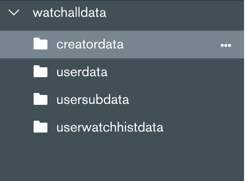
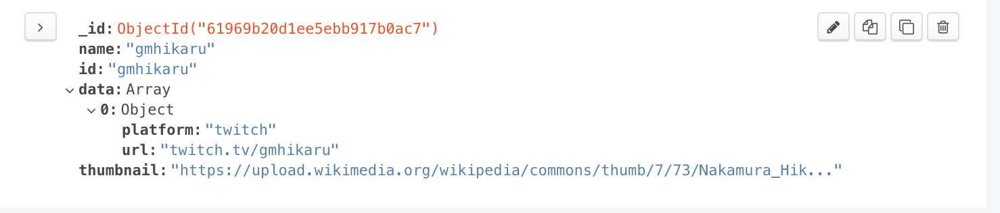
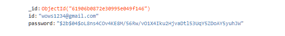
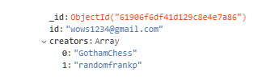
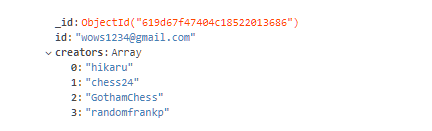

# CS 326 Project
# Milestone 3

App: https://cs-326-alpha.herokuapp.com/

## Database
We have 4 data collections.



### creatordata
```
{
	_id: <ObjectId1>,
	name: String,  // The name of the channel
	id: String,  // The id of the channel, same as name for now
    data: Array,
        > 0: Object
            platform: String, // twitch or youtube
            ulr: String, // url of the video/channel
    thumbnail: String, // web url to the channel's thumbnail
}
```
For example,



### userdata
```
{
	_id: <ObjectId1>,
	id: String,  // The email of the account
    password: String // Salted + hashed password
}
```
For example,

### usersubdata
```
{
	_id: <ObjectId1>,
	id: String,  // The email of the account
    creators: Array,
      > 0: String // the id of the channel
}
```
For example, 


### userwatchhistdata
```
{
	_id: <ObjectId1>,
	id: String,  // The email of the account
    creators: Array,
      > 0: String // the id of the channel
}
```
For example,

## Demo


<figure class="video_container">
  <video controls="true" allowfullscreen="true">
    <source src="./images/demo_milestone3.mp4" type="video/mp4">
  </video>
</figure>


## Division of Labor

- Liam Brandwein - mongoDB, subscribe functionalities.
- Long Le - mongoDB, history functionalities.